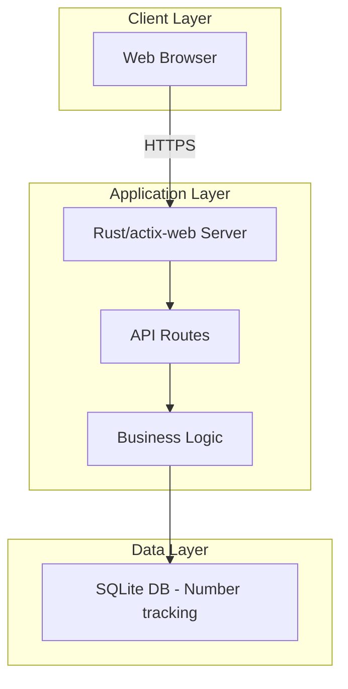

# WhatsApp Virtual Number Verification Service - Architecture Plan

## 1. Executive Summary

**Project Goal:** Build a small-scale web application that helps users get free virtual phone numbers for WhatsApp verification using TextNow.

**Scope:** Personal project for testing/learning with handful of users.

**Note:** This solution uses TextNow's free service - numbers are obtained manually through TextNow app/website, and the web app provides guidance and management features.

---

## 2. Phone Number Source

### TextNow (Free)

| Feature | Details |
|---------|----------|
| Cost | Free |
| Numbers | US/Canada available |
| Verification | Manual via TextNow app |
| WhatsApp Support | Yes |
| API Available | No (manual process) |

### How It Works

```
1. User visits our web app
2. User gets a TextNow number (manual)
3. User enters number in our app
4. User verifies on WhatsApp
5. Our app helps track/manage the number
```

---

## 3. System Architecture

### High-Level Design



### What This App Provides

Instead of an API-based service, this web app will:

1. **Display TextNow number info** - Guide users to get free numbers
2. **Number tracking** - Store which numbers users have used
3. **WhatsApp verification guide** - Step-by-step instructions
4. **Verification status** - Help users track their verification progress

---

## 4. Implementation Steps

### Phase 1: Project Setup
- [ ] Add SQLite dependency to [`Cargo.toml`](Cargo.toml:1)
- [ ] Create database schema for tracking numbers
- [ ] Set up environment configuration

### Phase 2: Backend API
- [ ] Implement `POST /api/numbers/register` - Register a user's number
- [ ] Implement `GET /api/numbers/my` - List user's registered numbers
- [ ] Implement `POST /api/numbers/{id}/verify` - Mark as WhatsApp verified
- [ ] Implement `DELETE /api/numbers/{id}` - Remove a number
- [ ] Add error handling and logging

### Phase 3: Frontend
- [ ] Create new HTML page `/verify-whatsapp.html`
- [ ] Components:
  - TextNow number guide/widget
  - Number input form
  - Verification status tracker
  - Step-by-step instructions
- [ ] Style with CSS (match existing site design)

### Phase 4: Integration
- [ ] Integrate new routes into main.rs
- [ ] Add configuration via environment variables
- [ ] Test end-to-end flow

---

## 5. File Structure

```
suraga-website/
├── src/
│   ├── main.rs              # Existing - add new routes
│   ├── verification/
│   │   ├── mod.rs           # Module definition
│   │   ├── api.rs           # HTTP handlers
│   │   └── models.rs        # Data structures
│   └── db.rs                # Database operations
├── public/
│   ├── verify-whatsapp.html # New frontend page
│   └── js/
│       └── verify.js        # Frontend logic
├── Cargo.toml               # Add dependencies
└── .env.example             # Environment variables template
```

---

## 6. Dependencies

### Rust (Cargo.toml additions)
```toml
[dependencies]
rusqlite = { version = "0.31", features = ["bundled"] }
tokio = { version = "1", features = ["full"] }
chrono = { version = "0.4", features = ["serde"] }
```

### Environment Variables Required
```
DATABASE_URL=./verification.db
```

---

## 7. Features

### User Flow

1. **Landing Page**
   - Explanation of TextNow free numbers
   - "Get Started" button

2. **Get Number**
   - Instructions to download TextNow app
   - Guide to get free US/Canada number
   - Input field to enter obtained number

3. **Verify with WhatsApp**
   - Step-by-step WhatsApp verification guide
   - Status tracking

4. **Dashboard**
   - List of registered numbers
   - Verification status
   - Option to add notes

---

## 8. Next Steps

Once you approve this plan, I can proceed with implementation in the following order:

1. **Phase 1**: Set up project structure and database
2. **Phase 2**: Implement backend API
3. **Phase 3**: Build frontend interface
4. **Phase 4**: Integration and testing

**Note:** This is a manual/guided approach since TextNow doesn't provide a free API for automated number retrieval. Users will need to get numbers manually through the TextNow app.
